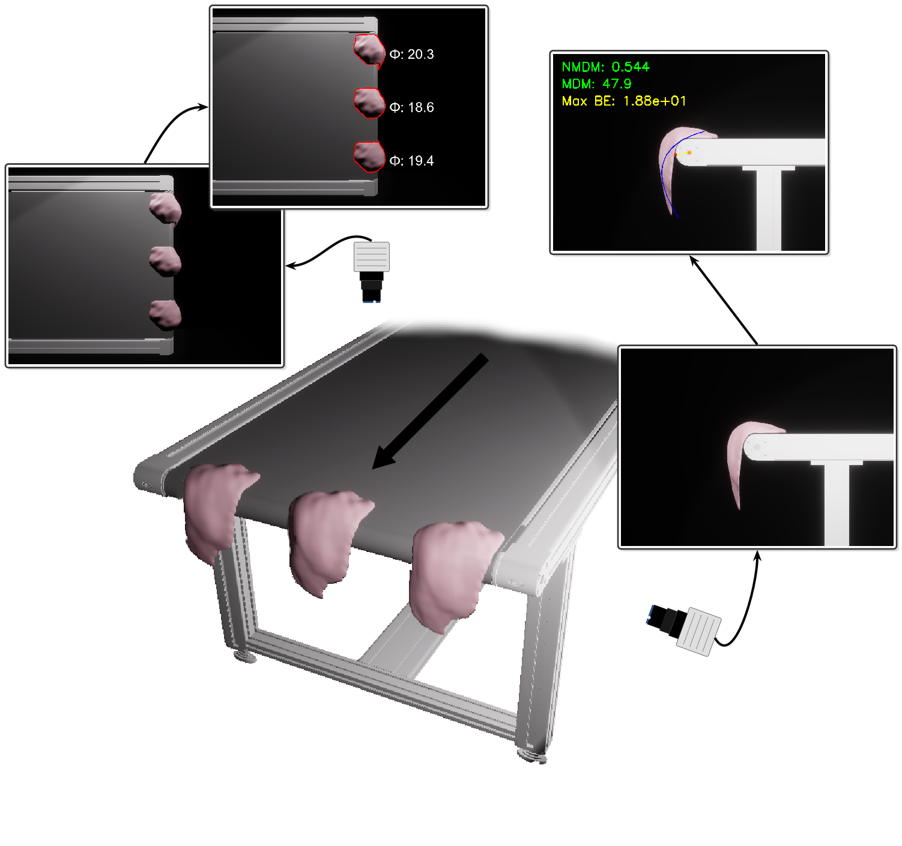
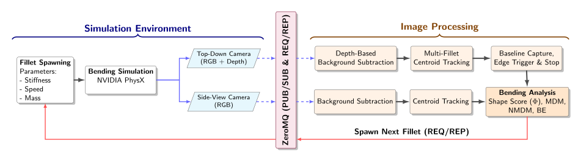
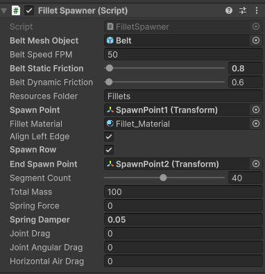

## Simulation-Based Multi-Fillet Evaluation of Woody Breast Poultry Fillets

### Overview

Woody breast (WB) is a myopathy in modern broiler chickens that causes the
breast muscle to become unusually stiff and fibrous, leading to decreased meat
quality and significant economic losses. State-of-the-art automated WB
detection relies on a side-view imaging system to analyze the bending behavior
of a single fillet as it falls off a conveyor belt. While highly accurate, this
approach is constrained by its single-fillet field of view, creating throughput
bottlenecks on commercial processing lines. 

<p align="center">
  
</p>

This repository provides the source code and Unity simulation framework for our
2026 IEEE Conference on Automation Science and Engineering paper titled
"[Simulation-Based Multi-Fillet Evaluation of Woody Breast Poultry Fillets](https://arxiv.org/pdf/2606.16951)."
We address throughput limitations via a novel multi-fillet detection
architecture utilizing a top-down camera configuration.  To validate our
approach, we developed a high-fidelity digital twin of an industrial conveyor
system and modeled the viscoelastic bending dynamics of 3D fillet meshes using
NVIDIA PhysX. Experimental results demonstrate that the continuous 2D shape
deformation score extracted from the top-down perspective effectively captures
contour changes, providing a robust and scalable alternative for simultaneous
multi-fillet WB evaluation.

### Citation

If you find this project useful, then please consider citing both our paper and
dataset.

```bibtex
@inproceedings{senmukherjee2026simulation,
  title={Simulation-based multi-fillet evaluation of woody breast poultry fillets},
  author={Sen Mukherjee, Chirantan and Yoon, Seung-Chul and Beksi, William J},
  booktitle={2026 IEEE 22nd International Conference on Automation Science and Engineering (CASE)},
  pages={},
  year={2026}
}

@data{mavmatrix/dataset.2026.02.049,
  title={{Synthetic-Chicken-Fillets}},
  author={Sen Mukherjee, Chirantan and Yoon, Seung-Chul and Beksi, William J},
  publisher={MavMatrix},
  version={V1},
  url={https://doi.org/10.32855/dataset.2026.02.049},
  doi={10.32855/dataset.2026.02.049},
  year={2026}
```

### Simulation Pipeline 

<p align="center">
  
</p>

### Installation 

First, begin by cloning the project:

    $ git clone https://github.com/robotic-vision-lab/Simulation-Based-Multi-Fillet-Evaluation-of-Woody-Breast-Poultry-Fillets.git
    $ cd Simulation-Based-Multi-Fillet-Evaluation-of-Woody-Breast-Poultry-Fillets.git

Next, create a Python virtual environment and install the evaluation
dependencies:

    $ python -m venv .venv
    $ .venv\Scripts\activate   # On Windows
    $ pip install -r requirements.txt

**Unity Environment:** This project uses **Unity 6000.2.6f2** with the High
Definition Render Pipeline. Add the cloned repository folder to Unity Hub and
open the project. 

### Dataset

Our [Synthetic-Chicken-Fillets](https://mavmatrix.uta.edu/rvl_agri_datasets2/1/) 
dataset contains 1,000 3D fillet meshes and is hosted externally to keep this
repository lightweight. Download the dataset and extract the `.obj` files into
the `Assets/Resources/Fillets/` directory within the Unity project. *Note: A
very small portion of the dataset is included by default in this repository for
immediate testing.*

### Usage 

#### Bending Evaluation

To start the simulation framework, press **Play** in the Unity Editor while in
one of the scenes. Find the corresponding Python script from your active
virtual environment. You must provide an output directory for the generated CSV
files:

    $ python python_tools/overview_eval.py --dir "results/experiment_1"

Once the Unity script is running and indicates that it is waiting for sockets
to be received (in the console), run the Python script.

#### Simulation Parameters

The Spawner GameObject in the hierarchy houses the simulation parameters that
control the conveyor belt speed, friction, as well as the fillet dynamics and
movement. Some of these parameters are controlled via the Python scripts.

<p align="center">
  
</p>
   
### License

[](https://github.com/robotic-vision-lab/Simulation-Based-Multi-Fillet-Evaluation-of-Woody-Breast-Poultry-Fillets/blob/main/LICENSE)
